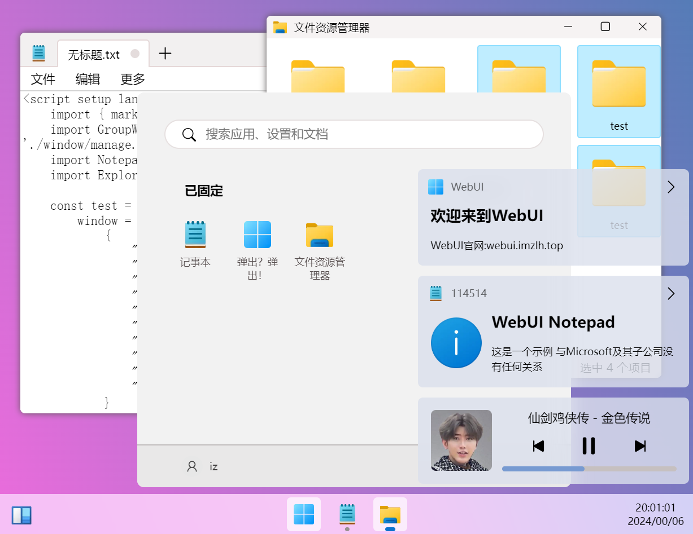

# Win11UI
这是一个用于模仿windows11的界面UI库
使用VUE简单实现逻辑，主要是SCSS+HTML，开箱即用。SCSS多mixin，可以方便自定义
这个项目将长期维护，直到winb项目的问世

# 试试看？
`npm i && npm run dev`，打开**localhost:8000**即可

# 预览

虽然这是UI库,但是我还是设计了一些逻辑和动画(要求不能太高吧)

注：此项目受Win11React的启发设计，但是进行了全面重构。本项目不附属于微软或为win11react的升级版